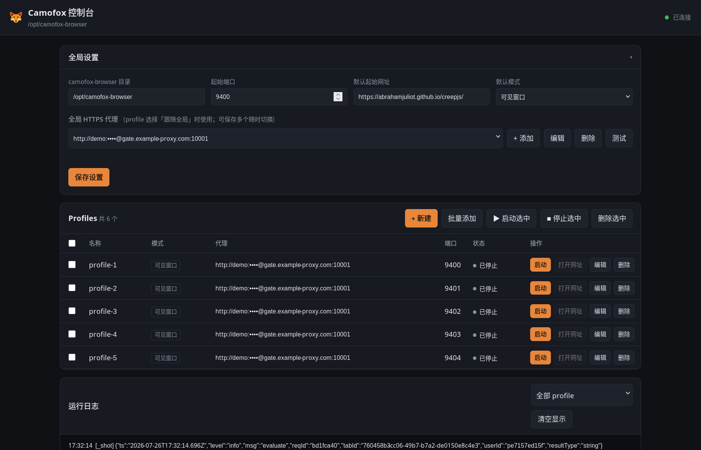
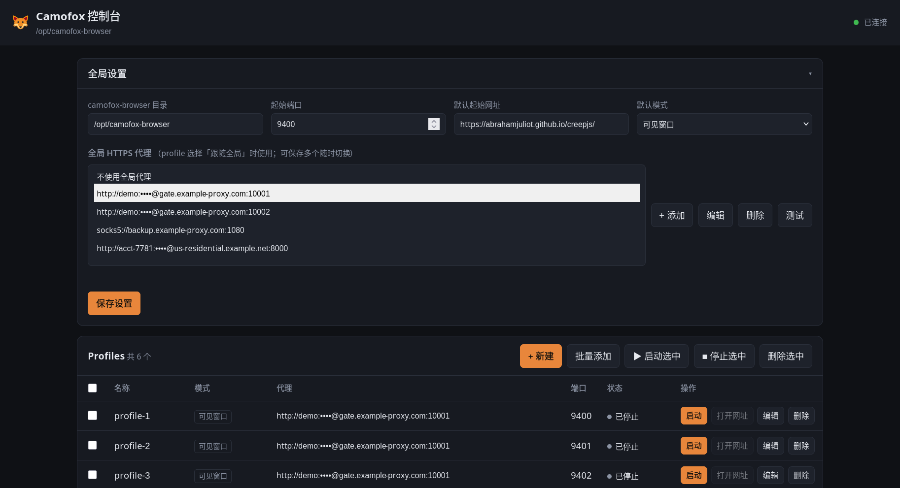

# camofox-gui

[camofox-browser](https://github.com/jo-inc/camofox-browser) 的本地图形控制台：在界面里维护一组 HTTPS 代理、单个或批量创建 profile，点一下就启动一个带独立指纹与独立代理的浏览器窗口。

> A local control panel for camofox-browser — per-profile HTTPS proxies, batch profile creation, one-click launch. Zero dependencies, Node stdlib only.



零依赖 —— 只用 Node 标准库，不需要 `npm install`。

```bash
./start.sh              # 默认 http://127.0.0.1:8790，自动打开浏览器
./start.sh --port 9000 --no-open
```

## 能做什么

- **代理池** —— 保存多个 HTTPS / SOCKS5 代理，下拉切换当前生效的那个。粘贴一次可以加一批，密码在界面上一律打码。
- **每个 profile 独立代理** —— 可选「跟随全局 / 独立代理 / 不使用代理」，互不干扰。
- **代理测试** —— 通过代理建真实 HTTPS 隧道，返回出口 IP、国家和延迟。
- **批量创建** —— 粘贴一份代理列表一行生成一个 profile；代理条数不够时会问你是循环使用、还是让多出的跟随全局。
- **一键启动** —— 可见窗口模式下浏览器窗口直接出现在桌面上，可以手动登录、过验证码；无头模式则只跑服务，给出该实例的 REST API 入口供脚本调用。
- **会话隔离** —— 每个 profile 的 cookie / localStorage / 登录态存在各自目录，由 camofox-browser 的 persistence 插件负责落盘。
- **实时日志** —— 每个 profile 的 server 输出通过 SSE 推到界面。



## 为什么是「一个 profile 一个进程」

camofox-browser 的代理来自环境变量（`PROXY_HOST` / `PROXY_PORT` / `PROXY_USERNAME` / `PROXY_PASSWORD`），
而且一个进程只维护一个 Camoufox 实例。所以「每个 profile 各自的代理」只能靠**每个 profile 独立起一个 server 进程**实现：

```
camofox-gui (8790)
├─ profile-1 → node server.js  CAMOFOX_PORT=9400  PROXY_HOST=a.b.c.d  CAMOFOX_PROFILE_DIR=~/.camofox-gui/profiles/<id>/profile
├─ profile-2 → node server.js  CAMOFOX_PORT=9401  PROXY_HOST=e.f.g.h  ...
└─ ...
```

启动流程：`spawn server.js` → 等 `/health` → `POST /start` 预热 Camoufox → `POST /tabs` 打开起始网址。

## 准备工作

需要 Node 20+（推荐 24，见下方「受限网络」一节）。

```bash
git clone https://github.com/peach0x33a/camofox-browser-gui
git clone https://github.com/jo-inc/camofox-browser     # 放在同级目录，GUI 会自动探测

cd camofox-browser
npm install                 # 安装依赖
npx camoufox-js fetch       # 下载 Camoufox 浏览器内核（663MB，只需一次）

cd ../camofox-browser-gui
./scripts/install-plugin.sh # 装 desktop 插件（可见窗口模式需要，见下）
./start.sh
```

内核会装到 `~/.cache/camoufox/`。已经有 Camoufox bundle 的话，可以改用
`CAMOUFOX_EXECUTABLE=/path/to/camoufox-bin ./start.sh` 跳过下载。
内核缺失时点「启动」会直接给出中文提示，不会甩一串 Playwright 报错。

探测不到 camofox-browser 目录时，在界面「全局设置」里手动填路径即可。

## 可见窗口是怎么实现的

Linux 上 camofox-browser 总是把 Camoufox 渲染到一块临时 Xvfb 虚拟屏，所以窗口默认看不见。
本项目附带一个 camofox-browser 插件 `camofox-browser-plugin/desktop/`，它替换 `ctx.createVirtualDisplay`，
让浏览器渲染到你真实的 X display（`$DISPLAY`）。插件同时支持 `socks5://` / `https://` 这类
环境变量代理池表达不了的代理。

`scripts/install-plugin.sh` 会把它复制到 camofox-browser 的 `plugins/desktop/` 并在 `camofox.config.json` 里注册
（原文件自动备份，可重复执行）。插件默认是**惰性的**：不设置 `CAMOFOX_DESKTOP_*` 环境变量时什么都不做，
所以不影响 camofox-browser 的原有行为。GUI 只在「可见窗口」模式下才会设置这些变量。

KDE / Wayland 下 Camoufox 走 Wayland 后端，窗口由 KWin 管理，`wmctrl`/`xwininfo` 这类 X11 工具列不出来，
但窗口确实在桌面上（`kdotool search` 能看到 class 为 `camoufox` 的窗口）。

## 在受限网络下使用（需要科学上网时）

Camoufox 首次带代理启动时，还会去 GitHub 下载 ~63MB 的 GeoIP 库（用来按代理出口 IP 伪装时区和语言），
以及 uBlock Origin 扩展。这些下载走的是 Node 的 `fetch()`，**默认不认 `http_proxy` 环境变量**。
所以在需要代理才能访问 GitHub 的网络里，请带着代理变量启动 GUI：

```bash
export https_proxy=http://127.0.0.1:7890 http_proxy=http://127.0.0.1:7890
./start.sh
```

GUI 检测到这些变量后，会自动给每个 profile 的子进程加上 `NODE_USE_ENV_PROXY=1`（Node 24+ 生效），
让这些首次下载也走代理。

内核本身（663MB）用 `camoufox-js fetch` 可能很慢，实测用 curl 直接下快十倍：

```bash
curl -L --retry 5 -C - -o /tmp/camoufox.zip \
  https://github.com/daijro/camoufox/releases/download/v152.0.4-beta.28/camoufox-152.0.4-beta.28-lin.x86_64.zip
```

下完解压到 `~/.cache/camoufox/`，再写一个 `version.json`（`{"version":"152.0.4","release":"beta.28"}`）即可。
注意校验文件大小，下载被截断会报 `Invalid Extended Type at offset 0`。

## 数据位置

| 路径 | 内容 |
| --- | --- |
| `~/.camofox-gui/config.json` | 全局设置、代理池、profile 列表（代理密码明文存储） |
| `~/.camofox-gui/profiles/<id>/profile` | 该 profile 的 storage state（cookie / localStorage） |
| `~/.camofox-gui/profiles/<id>/cookies` | 导入的 cookie 文件 |
| `~/.camofox-gui/gui.lock` | 实例锁，防止两个 GUI 共用同一数据目录 |

删除 profile 时会一并删除对应目录。用 `CAMOFOX_GUI_DATA_DIR` 可以换数据目录。

## 说明与限制

- 服务只监听 `127.0.0.1`，并拒绝跨源请求；不要把它暴露到公网。
- 代理密码在磁盘上是明文（启动浏览器需要），但界面和 API 响应里一律是 `••••••`。
- 「可见窗口」模式下 GUI 会把 server 的会话/标签页回收超时调到 7 天，避免你正在手动操作时窗口被当成空闲回收。
  无头模式保持 camofox-browser 的默认值（标签页闲置 5 分钟回收）。
- `http` 协议的代理走 camofox-browser 原生代理池，能顺带拿到基于出口 IP 的时区/语言伪装；
  `https` 与 `socks5` 走 desktop 插件直接注入，**不会**做 GeoIP 伪装。
- 批量启动是串行的：同时拉起多个 Camoufox 既吃内存，也更容易触发风控。批量启动途中点「停止全部」会取消剩余队列。
- 手动关掉浏览器窗口后 server 仍在运行，点「打开网址」会在同一个 profile 会话里重新拉起窗口。
- 代理测试依次尝试 `www.cloudflare.com/cdn-cgi/trace` → `ipinfo.io` → `api.ipify.org` → `ifconfig.me`，
  任意一个通就算通过。单一测试点在国内线路上经常误报。

## 命令行参数

| 参数 | 说明 |
| --- | --- |
| `--port <n>` | GUI 端口，默认 8790（也可用 `CAMOFOX_GUI_PORT`） |
| `--host <addr>` | 监听地址，默认 127.0.0.1 |
| `--no-open` | 不自动打开浏览器 |

环境变量：`CAMOFOX_GUI_DATA_DIR` 改数据目录，`CAMOFOX_DIR` 指定 camofox-browser 位置，
`CAMOUFOX_EXECUTABLE` 指定已有的 Camoufox 二进制。

## 目录结构

```
src/            后端：main(HTTP+静态) / api(路由+SSE) / manager(进程生命周期) / store(持久化) / proxy(解析+隧道测试) / paths
public/         前端：无框架原生 JS
camofox-browser-plugin/desktop/   给 camofox-browser 用的插件（由 scripts/install-plugin.sh 安装）
scripts/        安装脚本
```

## 致谢

- [Camoufox](https://camoufox.com) —— 在 C++ 层做指纹伪装的 Firefox 分支
- [camofox-browser](https://github.com/jo-inc/camofox-browser) —— 本项目驱动的服务端
