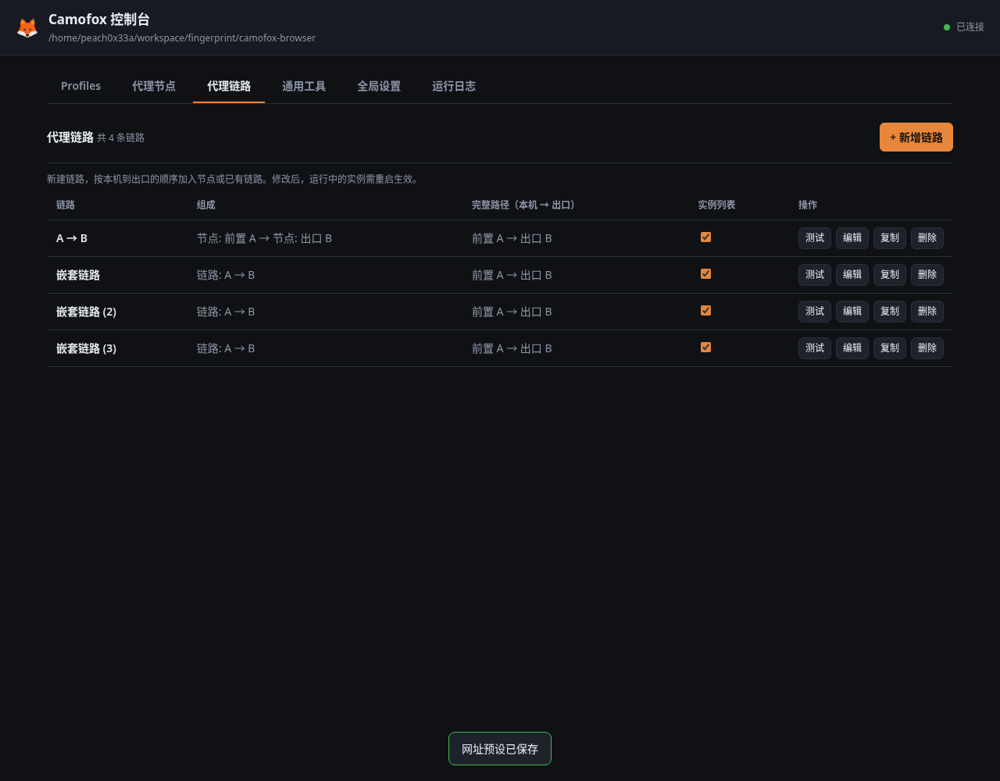

# camofox-gui

[camofox-browser](https://github.com/jo-inc/camofox-browser) 的本地图形控制台：维护可组合的代理节点、单个或批量创建 profile，点一下就启动一个带独立指纹与独立代理链路的浏览器窗口。

> A local control panel for camofox-browser — per-profile HTTPS proxies, batch profile creation, one-click launch. Zero dependencies, Node stdlib only.



零依赖 —— 只用 Node 标准库，不需要 `npm install`。

控制台以 **Profiles** 为默认标签，可切换到「代理节点」「代理链路」「通用工具」「全局设置」「运行日志」；页面内容采用无圆角卡片的平面布局。

```bash
./start.sh              # 默认 http://127.0.0.1:8790，自动打开浏览器
./start.sh --port 9000 --no-open
```

## macOS / Windows 原生使用

已补齐两平台的原生启动和可见窗口代码，不需要 WSL 或 X server。当前本机验证环境为 Linux；macOS / Windows 的原生窗口、系统屏幕读取和进程树清理仍待实机验证。仓库提供三平台 GitHub Actions 离线测试矩阵。

先安装 **Node.js 24** 和 Git。在终端（Windows 用 PowerShell）依次执行：

```text
git clone https://github.com/peach0x33a/camofox-browser-gui
git clone https://github.com/jo-inc/camofox-browser
cd camofox-browser
npm install
npx camoufox-js fetch
cd ../camofox-browser-gui
npm run install-plugin
npm start
```

下载器会按当前系统和 CPU 选择内核；不要使用下文示例里的 Linux ZIP。当前 camoufox-js 0.10.2 支持 macOS Intel / Apple Silicon、Windows x64 / x86；Windows ARM64 原生内核不在该版本支持矩阵中。

打开 `http://127.0.0.1:8790`，在「全局设置」确认 camofox-browser 路径，在「Profiles」新建实例并选择「可见窗口」，点击「启动」。需要代理时先添加并测试代理节点。运行期间保持终端开启，退出用 Ctrl+C，等待实例停止后再关闭终端。

- **macOS**：也可执行 `bash start.sh`；GUI 用系统 `open` 打开控制台，Camoufox 直接显示原生窗口。
- **Windows**：安装完成后也可双击 `start.cmd`。无需执行 `.sh`；PowerShell 如果拦截 `npm.ps1` / `npx.ps1`，使用 `npm.cmd` / `npx.cmd` 执行上述命令。
- 两平台可见窗口按系统屏幕工作区调整尺寸；屏幕查询失败时保留内核原有尺寸。Windows 停止实例通过 IPC 调用服务的正常退出处理，超时才结束该服务的进程树。
- GUI 升级后重新执行 `npm run install-plugin`，再重启 GUI 和实例。自定义目录可用 `npm run install-plugin -- "实际的 camofox-browser 路径"`。

首次下载需要代理时，在启动 GUI **之前**设置环境变量（端口按实际代理软件修改）：

macOS：

```bash
export http_proxy=http://127.0.0.1:7890
export https_proxy=http://127.0.0.1:7890
export NODE_USE_ENV_PROXY=1
npm start
```

Windows PowerShell：

```powershell
$env:http_proxy = "http://127.0.0.1:7890"
$env:https_proxy = "http://127.0.0.1:7890"
$env:NODE_USE_ENV_PROXY = "1"
npm.cmd start
```

内核缓存：macOS 为 `~/Library/Caches/camoufox/`，Windows 默认 `%USERPROFILE%\AppData\Local\camoufox\camoufox\Cache\`。已有内核也可设置 `CAMOUFOX_EXECUTABLE` 指向实际可执行文件：macOS 的 `Camoufox.app/Contents/MacOS/camoufox`，Windows 的 `camoufox.exe`。

## 能做什么

- **代理节点** —— 在独立标签保存或批量导入 HTTP / HTTPS / SOCKS5 节点，管理地址、凭据及是否展示在实例列表。
- **代理链路** —— 独立创建并命名链路，按本机到出口顺序添加节点或已有链路，支持嵌套、调整顺序、测试。展开后最多 32 个节点；失败不会回退直连。
- **展示与复制** —— 节点和链路各自设置是否展示在实例列表。隐藏的节点或链路仍可用作链路组件；已被实例选中的项目需先切换实例才能隐藏或删除。节点或链路可指定数量批量复制，链路复制保留组件引用。
- **实例选择** —— 新建、编辑和批量创建只选择展示的节点或链路，也可不使用代理。支持粘贴节点地址，代理密码在界面上一律打码。修改运行中的配置需重启实例生效。
- **代理测试** —— 通过代理建真实 HTTPS 隧道，返回出口 IP、国家和延迟。
- **批量创建** —— 指定数量和展示的节点或链路，批量生成使用同一代理配置的 profile。
- **通用工具** —— 计算 Base32 密钥的六位 TOTP；“账号清单解析”从每行 `账号----密码----2FA密钥` 提取账号、密码、密钥和动态验证码，各列可复制，每行验证码下方的进度条显示剩余有效时间。内容仅在当前页面内存中，不存入配置。
- **网址预设** —— 点击实例的“打开网址”，可输入 `chatgpt.com` 这样的域名并保存为所有实例共用的预设；未写协议时使用 HTTPS。
- **一键启动** —— 可见窗口模式下浏览器窗口直接出现在桌面上，可以手动登录、过验证码；无头模式则只跑服务，给出该实例的 REST API 入口供脚本调用。
- **会话隔离** —— 每个 profile 的 cookie / localStorage / 登录态存在各自目录，由 camofox-browser 的 persistence 插件负责落盘。
- **实时日志** —— 每个 profile 的 server 输出通过 SSE 推到界面。

## 为什么是「一个 profile 一个进程」

camofox-browser 的代理来自环境变量（`PROXY_HOST` / `PROXY_PORT` / `PROXY_USERNAME` / `PROXY_PASSWORD`），
而且一个进程只维护一个 Camoufox 实例。所以「每个 profile 各自的代理」只能靠**每个 profile 独立起一个 server 进程**实现：

```
camofox-gui (8790)
├─ profile-1 → node server.js  CAMOFOX_PORT=9400  PROXY_HOST=a.b.c.d  CAMOFOX_PROFILE_DIR=~/.camofox-gui/profiles/<id>/profile
├─ profile-2 → node server.js  CAMOFOX_PORT=9401  PROXY_HOST=e.f.g.h  ...
└─ ...
```

启动流程：多节点链路先创建本地代理转发器 → `spawn server.js` → 等服务就绪 → `POST /start` → `POST /tabs`。单节点直接连接代理。可见模式通过只读 `/desktop/status` 检查状态；无头模式使用 `/health`。转发器随实例退出关闭，不写入固定端口配置。

## 准备工作

GUI 需要 Node 20+，当前同级 camofox-browser 需要 Node 22+；新安装统一推荐 Node 24（见下方「受限网络」一节）。

```bash
git clone https://github.com/peach0x33a/camofox-browser-gui
git clone https://github.com/jo-inc/camofox-browser     # 放在同级目录，GUI 会自动探测

cd camofox-browser
npm install                 # 安装依赖
npx camoufox-js fetch       # 下载 Camoufox 浏览器内核（663MB，只需一次）

cd ../camofox-browser-gui
./scripts/install-plugin.sh # 装 desktop 插件（可见窗口模式需要，见下）
./start.sh
```

内核会装到 `~/.cache/camoufox/`。已经有 Camoufox bundle 的话，可以改用
`CAMOUFOX_EXECUTABLE=/path/to/camoufox-bin ./start.sh` 跳过下载。
内核缺失时点「启动」会直接给出中文提示，不会甩一串 Playwright 报错。

探测不到 camofox-browser 目录时，在界面「全局设置」里手动填路径即可。

## 可见窗口是怎么实现的

macOS / Windows 下，desktop 插件在浏览器启动事件中启用原生有头模式，复用同一套页面关闭追踪和被动探活。

Linux 上 camofox-browser 总是把 Camoufox 渲染到一块临时 Xvfb 虚拟屏，所以窗口默认看不见。
本项目附带一个 camofox-browser 插件 `camofox-browser-plugin/desktop/`，它替换 `ctx.createVirtualDisplay`，
让浏览器渲染到你真实的 X display（`$DISPLAY`）。插件同时支持 `socks5://` / `https://` 这类
环境变量代理池表达不了的代理。

`scripts/install-plugin.sh` 会把它复制到 camofox-browser 的 `plugins/desktop/` 并在 `camofox.config.json` 里注册
（原文件自动备份，可重复执行）。插件默认是**惰性的**：不设置 `CAMOFOX_DESKTOP_*` 环境变量时什么都不做，
所以不影响 camofox-browser 的原有行为。GUI 的可见模式会启用桌面生命周期管理；HTTPS / SOCKS5 原始代理注入在无头模式也可生效。

可见模式将新窗口约束到当前 X 显示尺寸内，在现有页面执行无副作用的后台探活，不额外新建空白窗口。最后一个页面关闭或浏览器断开后，插件立即禁止自动重新拉起，并通过 IPC 通知 GUI 停止服务。GUI 定期读取被动状态作为兜底，不调用可能触发自动恢复的 `/health`。

**升级后先执行 `./scripts/install-plugin.sh`，再重启 GUI 和实例。** 可见模式会检查插件版本，旧插件需更新后才能启动。插件对上游无参数 `browser.newContext()` 的健康探测做兼容适配；升级 camofox-browser 后应重新运行浏览器集成验证。

KDE / Wayland 下 Camoufox 走 Wayland 后端，窗口由 KWin 管理，`wmctrl`/`xwininfo` 这类 X11 工具列不出来，
但窗口确实在桌面上（`kdotool search` 能看到 class 为 `camoufox` 的窗口）。

## 在受限网络下使用（需要科学上网时）

Camoufox 首次带代理启动时，还会去 GitHub 下载 ~63MB 的 GeoIP 库（用来按代理出口 IP 伪装时区和语言），
以及 uBlock Origin 扩展。这些下载走的是 Node 的 `fetch()`，**默认不认 `http_proxy` 环境变量**。
所以在需要代理才能访问 GitHub 的网络里，请带着代理变量启动 GUI：

```bash
export https_proxy=http://127.0.0.1:7890 http_proxy=http://127.0.0.1:7890
./start.sh
```

GUI 检测到这些变量后，会自动给每个 profile 的子进程加上 `NODE_USE_ENV_PROXY=1`（Node 24+ 生效），
让这些首次下载也走代理。

内核本身（663MB）用 `camoufox-js fetch` 可能很慢，实测用 curl 直接下快十倍：

```bash
curl -L --retry 5 -C - -o /tmp/camoufox.zip \
  https://github.com/daijro/camoufox/releases/download/v152.0.4-beta.28/camoufox-152.0.4-beta.28-lin.x86_64.zip
```

下完解压到 `~/.cache/camoufox/`，再写一个 `version.json`（`{"version":"152.0.4","release":"beta.28"}`）即可。
注意校验文件大小，下载被截断会报 `Invalid Extended Type at offset 0`。

## 数据位置

| 路径 | 内容 |
| --- | --- |
| `~/.camofox-gui/config.json` | 全局设置、代理节点、独立链路、网址预设与 profile 列表（代理密码明文存储） |
| `~/.camofox-gui/profiles/<id>/profile` | 该 profile 的 storage state（cookie / localStorage） |
| `~/.camofox-gui/profiles/<id>/cookies` | 导入的 cookie 文件 |
| `~/.camofox-gui/gui.lock` | 实例锁，防止两个 GUI 共用同一数据目录 |

删除 profile 时会一并删除对应目录。用 `CAMOFOX_GUI_DATA_DIR` 可以换数据目录。

## 说明与限制

- 服务只监听 `127.0.0.1`，并拒绝跨源请求；不要把它暴露到公网。
- 代理密码在磁盘上是明文（启动浏览器需要），但界面和 API 响应里一律是 `••••••`。
- 旧版的全局、独立和实例前置代理配置会迁移为节点及显式链路；原有实例的链路选择会保留。代理链路不替代内核/GeoIP 下载使用的系统 `http_proxy` / `https_proxy`。
- 「可见窗口」模式下 GUI 会把 server 的会话/标签页回收超时调到 7 天，避免你正在手动操作时窗口被当成空闲回收。
  无头模式保持 camofox-browser 的默认值（标签页闲置 5 分钟回收）。
- **单节点时**，`http` 代理走 camofox-browser 原生代理池；`https` 与 `socks5` 走 desktop 插件直接注入。**多节点时**，浏览器使用每次启动创建的本地 HTTP 转发器；GeoIP 行为以该 HTTP 代理路径为准。
- 批量启动是串行的：同时拉起多个 Camoufox 既吃内存，也更容易触发风控。批量启动途中点「停止全部」会取消剩余队列。
- 手动关闭最后一个浏览器页面后，该实例自动停止；重新打开需点击「启动」。服务不会为了探活或自动恢复再闪现一个窗口。无头模式保留上游恢复行为。
- 代理测试依次尝试 `www.cloudflare.com/cdn-cgi/trace` → `ipinfo.io` → `api.ipify.org` → `ifconfig.me`，
  任意一个通就算通过。单一测试点在国内线路上经常误报。

## 命令行参数

| 参数 | 说明 |
| --- | --- |
| `--port <n>` | GUI 端口，默认 8790（也可用 `CAMOFOX_GUI_PORT`） |
| `--host <addr>` | 监听地址，默认 127.0.0.1 |
| `--no-open` | 不自动打开浏览器 |

环境变量：`CAMOFOX_GUI_DATA_DIR` 改数据目录，`CAMOFOX_DIR` 指定 camofox-browser 位置，
`CAMOUFOX_EXECUTABLE` 指定已有的 Camoufox 二进制。

## 验证

`npm test` 运行纯本地测试：代理链协议组合、四跳传输、嵌套链路的环路与依赖、复制和配置迁移、失败不直连、转发器回收、实例进程生命周期、被动探活和密码回填。测试使用临时数据目录，自签名证书仅用于本地 fixture。

Linux 上用 `xvfb-run -a -s "-screen 0 1280x800x24" node scripts/verify-browser.mjs`，macOS / Windows 上用 `node scripts/verify-browser.mjs`，使用同级 camofox-browser 的 Playwright / Camoufox 依赖验证真实浏览器：链路新建/嵌套/复制、实例选择、网址预设、TOTP 与账号解析、桌面及手机布局、代理链访问、窗口尺寸、可见窗口探活与最后一页关闭。需已安装 Camoufox 内核和 Chromium；截图输出到 `.impeccable/review/`，不会操作已有实例。

默认使用同级 Playwright 对应的 Chromium 构建。若该构建未安装，可通过可选环境变量 `PLAYWRIGHT_CHROMIUM_EXECUTABLE` 指定本机已有的 Chromium 可执行文件，例如（路径请按实际安装位置调整）：

```bash
PLAYWRIGHT_CHROMIUM_EXECUTABLE="$HOME/.cache/ms-playwright/chromium-1234/chrome-linux64/chrome" \
  xvfb-run -a node scripts/verify-browser.mjs
```

## 目录结构

```
src/            后端：main(HTTP+静态) / api(路由+SSE) / manager(进程生命周期) / store(持久化) / proxy(解析+隧道测试) / paths
public/         前端：无框架原生 JS
camofox-browser-plugin/desktop/   给 camofox-browser 用的插件（由 scripts/install-plugin.sh 安装）
scripts/        安装脚本
```

## 致谢

- [Camoufox](https://camoufox.com) —— 在 C++ 层做指纹伪装的 Firefox 分支
- [camofox-browser](https://github.com/jo-inc/camofox-browser) —— 本项目驱动的服务端
